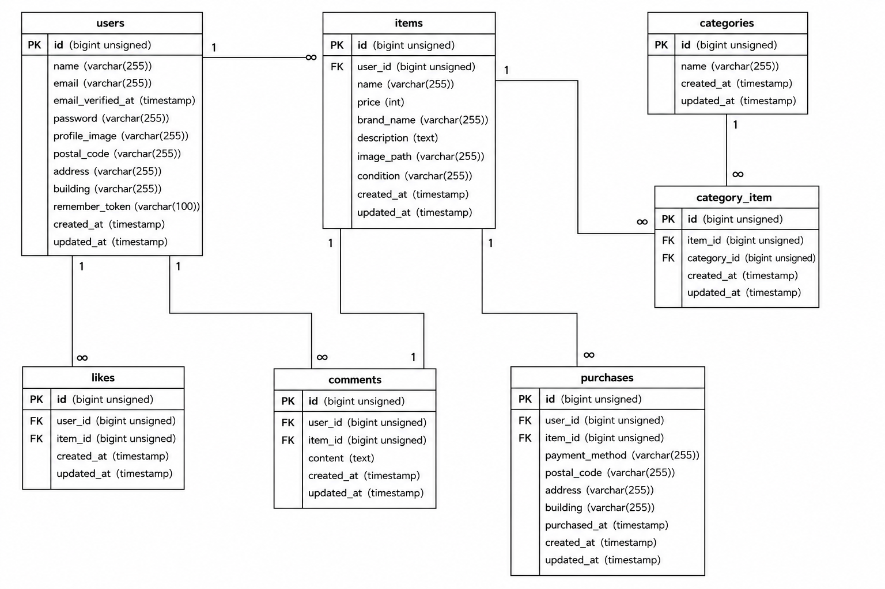

# flea-market-app

## アプリケーション名

COACHTECH フリマ

## 環境構築

### Dockerビルド

```bash
git clone git@github.com:yasuyasuikeikb-collab/flea-market-app.git
cd flea-market-app
docker compose up -d --build
```

### Laravel環境構築

PHPコンテナに入ります。

```bash
docker compose exec php bash
cd /var/www
```

Composerパッケージをインストールします。

```bash
composer install
```

`.env` ファイルを作成します。

```bash
cp .env.example .env
```

アプリケーションキーを作成します。

```bash
php artisan key:generate
```

`.env` ファイルを作成後、以下のDB接続設定を確認してください。

```env
DB_CONNECTION=mysql
DB_HOST=mysql
DB_PORT=3306
DB_DATABASE=laravel_db
DB_USERNAME=laravel_user
DB_PASSWORD=laravel_pass
```

メール認証確認用にMailHogを使用する場合は、以下のメール設定を確認してください。

```env
MAIL_MAILER=smtp
MAIL_HOST=mailhog
MAIL_PORT=1025
MAIL_USERNAME=null
MAIL_PASSWORD=null
MAIL_ENCRYPTION=null
MAIL_FROM_ADDRESS=test@example.com
MAIL_FROM_NAME="${APP_NAME}"
```

Stripeを使用する場合は、Stripeのテスト環境で取得したキーを設定してください。

```env
STRIPE_KEY=pk_test_xxxxxxxxxxxxxxxxxxxxx
STRIPE_SECRET=sk_test_xxxxxxxxxxxxxxxxxxxxx
```

マイグレーションを実行します。

```bash
php artisan migrate
```

必要に応じてシーディングを実行してください。

```bash
php artisan db:seed
```

ストレージリンクを作成します。

```bash
php artisan storage:link
```

## 使用技術（実行環境）

* PHP 8.x
* Laravel 8.x
* MySQL 8.0.26
* nginx 1.21.1
* Docker / Docker Compose
* MailHog
* Stripe

## ER図



## URL

* 開発環境：http://localhost
* phpMyAdmin：http://localhost:8080
* MailHog：http://localhost:8025

## 主なページ

* 商品一覧画面：http://localhost
* 会員登録画面：http://localhost/register
* ログイン画面：http://localhost/login
* マイページ：http://localhost/mypage
* 商品出品画面：http://localhost/sell
